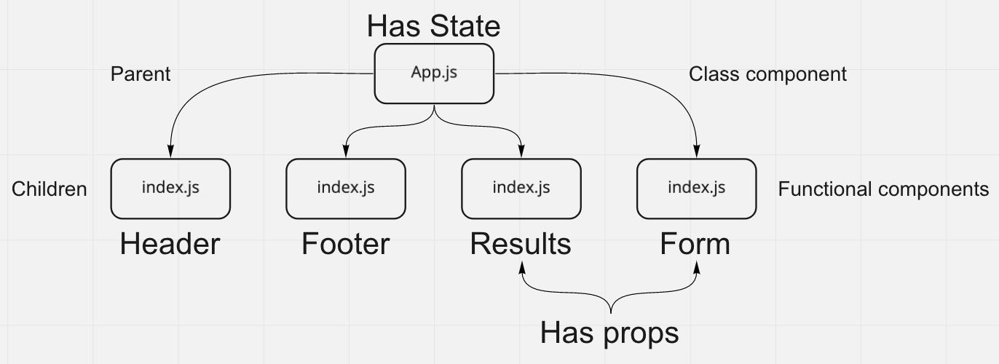

# Resty

## Author

Antoine Charette

## Problem Domain

### Part One

Today we are tasked with refactoring some starter React app code from class components to functional components.

## Components

- Header
- Footer
- Results
- Form
